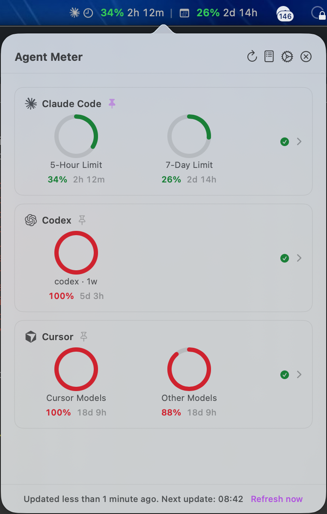
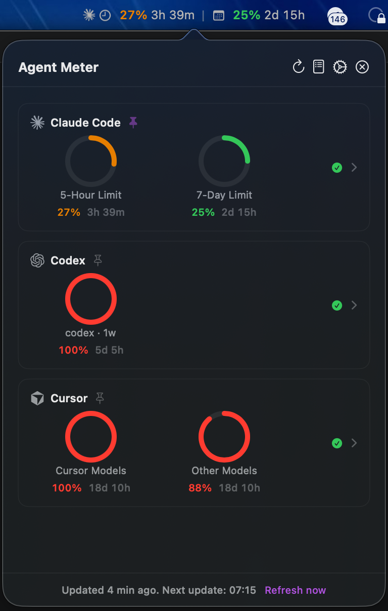

# Agent Meter

A native macOS menu bar app for monitoring subscription usage and rate limits
across coding agents. The first supported providers are Claude Code and Codex.

<p align="center">
  
  
</p>

## Features

- **Multiple providers**: Enable Claude Code, Codex, or both and switch without restarting
- **Dynamic limits**: Renders every rate-limit window reported by each provider
- **Menu bar widget**: Pin up to two provider metrics in Icon, Compact, or Detailed modes
- **Per-provider isolation**: A failed provider keeps its last successful snapshot and does not block the others
- **Notifications and caching**: Provider-scoped threshold alerts and offline snapshots
- **Secure fallback credentials**: Optional Claude web-session fallback is stored in Agent Meter's Keychain item, never in preferences
- **Native macOS**: Built with SwiftUI for a minimal resource footprint

## Requirements

- macOS 14.0 (Sonoma) or later
- At least one authenticated provider:
  - Claude Code CLI (`claude login`)
  - Codex CLI 0.146.0 or newer (`codex login`)
- Xcode 15.0+ (only to build from source)

## Installation

### Download release

1. Download the latest `AgentMeter-*.dmg` from the [Releases](https://github.com/tungnguyenson/agent-meter/releases) page
2. Open the DMG and drag **AgentMeter.app** into your Applications folder
3. Launch the app

> Full releases are signed with a Developer ID certificate and notarized by Apple, so they open without a Gatekeeper prompt. See [docs/releasing.md](docs/releasing.md) for how releases are built and signed.

### Build from source

```bash
# Clone the repository
git clone https://github.com/tungnguyenson/agent-meter.git
cd agent-meter

# Build a release .app into ./build/Build/Products/Release/
./scripts/build-app.sh

# Or build a distributable DMG (requires: pip install dmgbuild)
./scripts/create-dmg.sh [version]

# Or open in Xcode
open AgentMeter.xcodeproj
```

## Configuration

Agent Meter uses the sessions already owned by each CLI. It does not copy Codex
credentials and only reads the Claude Code keychain entry:

```bash
claude login
codex login
```

See [Claude Code provider](docs/providers/claude-code.md),
[Codex provider](docs/providers/codex.md), and
[feasibility](docs/feasibility.md) for the exact data sources and limitations.

### Settings

Open settings from the menu bar popover:

- **General**: Providers, Codex binary path, refresh interval, and optional Claude web fallback
- **Appearance**: Menu bar display mode (Icon Only / Compact / Detailed) and color scheme (Auto / Light / Dark)
- **Notifications**: Enable/disable alerts and configure the alert thresholds
- **About**: App version and information

## Terms of service compliance

Agent Meter only reads usage/quota numbers a provider's own official CLI
already has access to. It never sends a prompt, never calls a model, and
never spends a token or dollar of your quota — every request below is a
read of data the provider already computed for your account. Risk differs a
lot by provider, so each is assessed on what its code actually calls, not on
what the app is named:

- **Claude Code — low risk.** A single `GET /api/oauth/usage` against
  `api.anthropic.com` — the same internal endpoint the Claude Code CLI
  itself polls to show quota — using the OAuth token the CLI already stored
  in Keychain. No prompt is sent, so no rate limit is touched. The one
  caveat: this endpoint isn't part of Anthropic's published public API, and
  the request mirrors the CLI's own User-Agent so it's accepted; if
  Anthropic ever restricts it to CLI-only traffic, this integration could
  break or be blocked. See [docs/providers/claude-code.md](docs/providers/claude-code.md).
- **Codex — lowest risk.** JSON-RPC over stdio to the locally installed
  `codex app-server` process, the same documented interface OpenAI uses to
  power its own VS Code extension (see OpenAI's published
  [`codex-rs/app-server`](https://github.com/openai/codex/blob/main/codex-rs/app-server/README.md)
  protocol). Agent Meter never touches OpenAI's HTTP backend directly,
  never reads `~/.codex/auth.json`, and only calls read-only account
  methods. This is a sanctioned third-party integration surface, not a
  reverse-engineered one. See [docs/providers/codex.md](docs/providers/codex.md).
- **Cursor — highest risk, flagged rather than shipped quietly.** Cursor
  publishes no usage API for personal accounts (only an Enterprise/Team
  Admin API, per `cursor.com/docs/api`). The Cursor provider instead calls
  undocumented internal endpoints behind `cursor.com` found by probing the
  web dashboard's own network traffic, decodes the JWT in the session
  cookie Cursor's CLI stores in Keychain to authenticate as that dashboard
  session, and adds a forged `Origin` header to pass the endpoint's CSRF
  check. [Cursor's Terms of Service](https://cursor.com/terms-of-service)
  explicitly prohibit reverse engineering the Service's underlying
  structure, "probe, scan or attempt to penetrate the Service," and
  "harvest, scrape, or extract data from the Service" — this integration
  matches those clauses more directly than the other two providers do, so
  treat it as best-effort: read-only, nothing is logged, and it can break
  or be revoked without notice. See [docs/providers/cursor.md](docs/providers/cursor.md)
  for the full reverse-engineering notes.

This is not legal advice — Anthropic, OpenAI, and Cursor are the final
arbiters of their own terms.

## Architecture

The app separates provider acquisition from normalized usage state and UI:

```
AgentMeter/
├── App/                          # Lifecycle: entry point, menu bar, central AppState
├── Core/                         # Business logic (no SwiftUI)
│   ├── Constants.swift           # Endpoints, thresholds, timeouts, intervals
│   ├── DependencyContainer.swift # Service locator for dependency injection
│   ├── Protocols/                # Service abstractions (enable mock injection)
│   ├── Models/                   # UsageSnapshot, UsageMetric, settings
│   ├── Providers/                # Claude Code and Codex adapters
│   ├── Services/                 # API, Keychain, notifications
│   └── Managers/                 # Coordination, polling, per-provider cache
├── UI/                           # SwiftUI views
│   ├── MenuBar/                  # Status item rendering
│   ├── Popover/                  # Main usage display
│   ├── Settings/                 # Preferences
│   └── Components/               # Reusable views
└── Extensions/                   # Swift extensions
```

### Key components

- **UsageCoordinator**: Concurrent refresh with isolated provider state
- **ClaudeCodeProvider**: Anthropic OAuth usage API plus optional web fallback
- **CodexProvider**: Long-lived local `codex app-server` JSON-RPC client
- **SnapshotCacheManager**: Versioned snapshots in `~/Library/Caches/AgentMeter/Providers/`

## Development

```bash
# Run all tests
xcodebuild test -scheme AgentMeter

# Run a single test class
xcodebuild test -scheme AgentMeter -only-testing AgentMeterTests/UsageManagerTests
```

Pushes to `main` trigger the [Build DMG](.github/workflows/build-dmg.yml) GitHub Action, which builds, signs, and notarizes the app, packages a DMG, and publishes it as a prerelease. Pushing a `v*` tag (e.g. `v1.0.0`) publishes a full release instead. See [docs/releasing.md](docs/releasing.md) for the full pipeline, trigger rules, and the signing secrets it needs.

## Contributing

Contributions are welcome! Please read [CONTRIBUTING.md](CONTRIBUTING.md) for guidelines.

## License

This project is licensed under the MIT License — see the [LICENSE](LICENSE) file for details.

## Acknowledgments

- Forked from [puq-ai/claude-meter](https://github.com/puq-ai/claude-meter) by Ali Yilmaz ([puq.ai](https://puq.ai))
- Claude Code integration expanded to support multiple providers (Codex)
- Codex integration uses the locally installed Codex CLI app-server

---

**Originally developed by ali@[puq.ai](https://puq.ai)**
